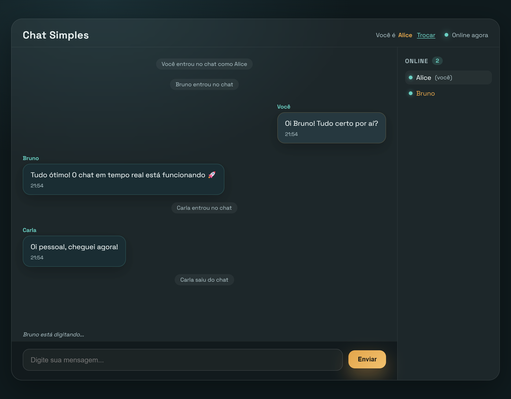

# Projeto Chat WebSocket

Aplicação de chat em tempo real separada em dois serviços: um backend em Python gerenciado com `uv` e um frontend utilizando TypeScript e Bun.



## ✨ Funcionalidades

- **Mensagens em tempo real** entre todos os usuários conectados.
- **Escolha de nome** ao entrar, com o último nome usado salvo no navegador. O nome pode ser trocado depois pelo botão **Trocar** no cabeçalho.
- **Nomes únicos**: o servidor recusa um nome que já está em uso.
- **Envio otimista**: a mensagem aparece na hora como "Enviando..." e é confirmada (ou marcada como "Falha ao enviar") quando o servidor responde. Mensagens com falha têm um botão **Tentar de novo**.
- **Lista de usuários online** na lateral, com destaque para quem está digitando. Em telas pequenas vira um contador no cabeçalho.
- **"Fulano está digitando..."** acima do campo de mensagem.
- **Avisos no chat** quando alguém entra, sai ou troca de nome.
- **Reconexão automática**: se a conexão cair, o chat tenta voltar sozinho (1s, 2s, 4s... até 30s) e entra de novo com o mesmo nome.
- **Status da conexão** no cabeçalho (Conectando, Online, Conexão perdida).

## 🛠️ Tecnologias Utilizadas

- **Backend:** Python, Pydantic, WebSockets, `uv` (Package Manager).
- **Frontend:** TypeScript, Vite, Bun, HTML/CSS.

## ⚙️ Pré-requisitos

Certifique-se de ter as seguintes ferramentas instaladas em sua máquina:

- [Python 3.14+](https://www.python.org/downloads/)
- [uv](https://github.com/astral-sh/uv) (Gerenciador de pacotes e ambientes Python)
- [Bun](https://bun.sh/) (Runtime e gerenciador de pacotes para o Frontend)

---

## 🚀 Como Executar o Projeto

O projeto é dividido em duas pastas distintas. Você precisará de dois terminais abertos para rodar o backend e o frontend simultaneamente.

### Usando o workspace do VS Code (recomendado)

O arquivo `chat.code-workspace` abre o `frontend` e o `backend` como pastas separadas no mesmo VS Code (multi-root workspace), cada uma com suas próprias configurações e ambiente.

1. Abra o workspace: **File > Open Workspace from File...** e selecione `chat.code-workspace`, ou pelo terminal:

   ```bash
   code chat.code-workspace
   ```

2. Abra um terminal para cada projeto: em **Terminal > New Terminal** (`` Ctrl+Shift+` ``), o VS Code pergunta em qual pasta abrir. Escolha `backend` para o primeiro terminal e repita escolhendo `frontend` para o segundo.

Cada terminal já abre dentro da pasta do projeto, então o `cd` dos passos abaixo não é necessário. Para ver os dois lado a lado, use **Split Terminal** (`Ctrl+Shift+5`).

### 1. Rodando o Backend (Python)

No primeiro terminal, inicie o servidor:

```bash
# Entre na pasta do backend
cd backend

# Sincronize as dependências e crie o ambiente virtual usando o uv
uv sync

# Inicie o servidor WebSocket
uv run python -m app.main
```

_O servidor escuta em `ws://0.0.0.0:3000`, ou seja, aceita conexões tanto da própria máquina quanto da rede local._

### 2. Rodando o Frontend (Bun)

No segundo terminal, inicie a aplicação:

```bash
# Entre na pasta do frontend
cd frontend

# Instale as dependências usando Bun
bun install

# Inicie o servidor de desenvolvimento
bun run dev
```

Acesse `http://localhost:5173` no navegador. Para testar a conversa, abra a página em duas abas (ou em uma janela anônima) e escolha um nome diferente em cada uma.

### Acessando de outro dispositivo da rede

Por padrão o Vite só aceita acessos da própria máquina. Para abrir o chat no celular ou em outro computador da mesma rede:

```bash
bun run dev --host
```

O Vite mostra o endereço de rede (ex: `http://192.168.0.10:5173`). Como o frontend conecta na porta `3000` do mesmo host que serviu a página, nenhuma configuração extra é necessária.

### Configurando o endereço do servidor

O frontend conecta em `ws://<host da página>:3000`. Para usar outro endereço, defina a variável `VITE_WS_URL`, por exemplo em um arquivo `frontend/.env.local`:

```bash
VITE_WS_URL=ws://localhost:4000
```

---

## 🔌 Protocolo WebSocket

Toda mensagem é um JSON com o campo `event`. Comandos do cliente que esperam confirmação levam um `id`, e o servidor responde com um `ACK` referenciando esse `id`.

**Cliente → Servidor**

| Evento         | Campos           | Descrição                                                   |
| -------------- | ---------------- | ----------------------------------------------------------- |
| `SET_USERNAME` | `id`, `username` | Define ou troca o nome (1 a 32 caracteres, único).          |
| `SEND_TEXT`    | `id`, `text`     | Envia uma mensagem (1 a 2000 caracteres). Exige nome.       |
| `TYPING`       | —                | Indica que o usuário está digitando (enviado no máximo a cada 2s). Exige nome. |

**Servidor → Cliente**

| Evento                      | Campos                         | Descrição                                                 |
| --------------------------- | ------------------------------ | --------------------------------------------------------- |
| `ACK`                       | `status`, `message_id`         | Confirma (`success`) ou recusa (`error`) um comando.      |
| `ERROR`                     | `message`, `detail`            | Explica o motivo de um erro.                              |
| `BROADCAST_TEXT`            | `author`, `text`               | Mensagem enviada por outro usuário.                       |
| `BROADCAST_TYPING`          | `username`                     | Outro usuário está digitando.                             |
| `BROADCAST_USER_JOINED`     | `username`                     | Um usuário entrou no chat.                                |
| `BROADCAST_USER_LEFT`       | `username`                     | Um usuário saiu do chat.                                  |
| `BROADCAST_USERNAME_CHANGE` | `old_username`, `new_username` | Um usuário trocou de nome.                                |
| `USER_LIST`                 | `usernames`                    | Enviado só para quem acabou de entrar: todos os nomes online, incluindo o próprio. |

Os broadcasts são enviados apenas para quem já entrou no chat com um nome, e nunca para o próprio autor.

---

## 📁 Estrutura do Projeto

```
backend/
  app/
    main.py        # Servidor WebSocket: conexões, nomes e broadcasts
    schemas.py     # Mensagens do protocolo validadas com Pydantic
frontend/
  index.html
  styles.css
  src/
    main.ts        # Inicializa a interface e conecta ao servidor
    socket.ts      # Conexão WebSocket, reconexão, ACKs e eventos para a interface
    types/         # Tipos das mensagens do protocolo
    ui/
      messages.ts  # Lista de mensagens, avisos e reenvio de mensagens com falha
      status.ts    # Indicador de conexão
      form.ts      # Campo de mensagem, botão Enviar e aviso de "digitando"
      username.ts  # Diálogo de nome e exibição do usuário atual
      online.ts    # Lista de usuários online
      typing.ts    # Indicador "fulano está digitando..."
    utils/         # Criação de mensagens, elementos do DOM e formatação
docs/
  screenshot.png
```

A interface não acessa o WebSocket diretamente: o `socket.ts` emite eventos (`messageReceived`, `userJoined`, `statusChange`...) e cada módulo de `ui/` reage apenas aos que lhe interessam.
